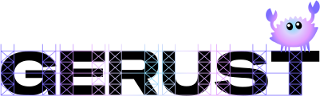

# Gerust

<picture>
  <source media="(prefers-color-scheme: dark)" srcset="./docs/logo-dark-mode.svg">
  
</picture>

Gerust provides an architecture and tooling for Rust backend projects. It takes care of the accidental complexity that comes with writing backends with Rust so you can stay focused on the essence of the system you're building:

* Separating distinct parts of the system into separate crates
* Organizing files into a logical folder structure
* Maintaining and running database migrations
* Isolating test cases that access the database
* Tracing and error handling
* and many more

For now, Gerust is just a project generator that creates the files and structure to get you started. There is no runtime dependency on Gerust – all the code is under your control.

Gerust projects are based on [axum](https://crates.io/crates/axum) and use [sqlx](https://crates.io/crates/sqlx) and PostgreSQL for data storage (if data storage is used at all).

> [!NOTE]
> This project has been created by [Mainmatter](https://mainmatter.com/rust-consulting/).  
> Check out our [landing page](https://mainmatter.com/rust-consulting/) if you're looking for Rust consulting or training!

## Creating a new project

A new project is created with the `gerust` command, e.g.:

```
gerust my-app
```

By default, Gerust will generate an empty project with the complete project structure as described below but without any actual entities, controllers, etc. If you're just getting started looking at Gerust, creating a full project, complete with example implementations of all concepts via `--full` might be a better starting point:

```
gerust my-app --full
```

For projects that do not need database access, there is also the `--minimal` option that will generate a project without any of the concepts and structure related to database access – no `db` crate, no [sqlx](https://crates.io/crates/sqlx) dependency.

## Project Structure

Gerust uses [Cargo workspaces](https://doc.rust-lang.org/book/ch14-03-cargo-workspaces.html) to separate distinct parts of the system into separate crates:

```
.
├── cli    // CLI tools for e.g. running DB migrations or generating project files
├── config // Defines the `Config` struct and handles building the configuration from environment-specific TOML files and environment variables
├── db     // Encapsulates database access, migrations, as well as entity definitions and related code (if the project uses a database)
├── macros // Contains macros, e.g. for application tests
└── web    // The web interface as well as tests for it
```

Let's see what these crates are resonsible for and how they work in detail:

### The `web` crate

The `web` crate contains the main [axum](https://crates.io/crates/axum) application, providing the web interface of the system. It contains the controllers with the implementations of the exposed endpoints, as well as any middlewares. The `web` crate also contains the application's main executable, which when starting up, will determine the environment the application runs in, load the configuration, initialize the app state, set up tracing and error handling, and bind the server to the configured interface.

The crate uses a simple folder structure:

```
web
├── controllers // Controllers implement request handlers for the exposed endpoints
├── middlewares // Tower middlewares for pre-processing requests before they are passed to the request handlers
├── lib.rs      // Code for starting up the server
├── main.rs     // Main entrypoint of the application
├── routes.rs   // Mapping of request handlers to routes
├── state.rs    // Definition and construction of the application state
└── tests       // Application tests
```

#### Testing

Application tests that cover the entire stack of the system including middlewares, controller, as well as database access are maintained in the `web` crate.

Testing backends is typically straight forward: request a particular endpoint with a particular method and potentially query string and/or request body and assert the response is what you expect. However, things become more complicated when the server you're testing uses a database. In your tests, you then need to seed the database with test data to establish a well-defined state for the test. You also need to clean up afterwards or better, use isolated database states for the different tests so they don't interfere with each other. There are several mechanisms for that like transactions, cleanup scripts, etc.

Gerust uses an approach for test isolation that allows parallel execution of tests without adding a ton of complexity: every test runs in its own database. These test-specific databases are automatically created as copies of the main test database and destroyed after the test has completed. All that is made easily available via the `[db_test]` macro:

```rs
pub struct DbTestContext {
    /// The axum application that is being tested.
    pub app: Router,
    /// A connection pool connected to the test-specific database; the app is set up to use this database automatically
    pub db_pool: DbPool,
}

#[db_test]
async fn test_read_all(context: &DbTestContext) {
    let task_changeset: TaskChangeset = Faker.fake();
    create_task(task_changeset.clone(), &context.db_pool) // create a task in the database
        .await
        .unwrap();

    let response = context
        .app
        .request("/tasks")
        .method(Method::GET)
        .send()
        .await;                                           // load all tasks

    assert_that!(response.status(), eq(StatusCode::OK));

    let tasks: TasksList = response.into_body().into_json::<TasksList>().await;
    assert_that!(tasks, len(eq(1)));
    assert_that!(                                         // assert the task created above is returned (as the application uses the same database)
        tasks.first().unwrap().description,
        eq(task_changeset.description)
    );
}
```

The concept of changesets as well as the database access utilities like `create_task`, are explained below.

### The `db` crate

The `db` crate only exists for projects that use a database and contains all functionality related to database access from entity definitions, functions for reading and writing data, as well as migrations. Gerust uses [sqlx](https://crates.io/crates/sqlx) and PostgreSQL without any additional ORM on top. Instead, it defines entities as simple structs along with functions for retrieving and persisting those entities. Validations are implemented via changesets that can get applied to or be converted to entities if they are valid:

```rs
#[derive(Serialize, Debug, Deserialize)]
pub struct Task {                                            // a Task entity with UUID id and text description
    pub id: Uuid,
    pub description: String,
}

#[derive(Deserialize, Validate, Clone)]
pub struct TaskChangeset {                                   // the changeset definition for the Task entity; it requires description to have a minimum length of 1
    #[validate(length(min = 1))]
    pub description: String,
}

pub async fn load(                                           // Function for loading a Task for an id
    id: Uuid,
    executor: impl sqlx::Executor<'_, Database = Postgres>,
) -> Result<Task, crate::Error> {
    match sqlx::query_as!(Task, "SELECT id, description FROM tasks WHERE id = $1", id)
        .fetch_optional(executor)
        .await
        .map_err(|e| crate::Error::DbError(e.into()))?
    {
        Some(task) => Ok(task),
        None => Err(crate::Error::NoRecordFound),
    }
}

pub async fn create(                                         // Function for creating a Task in the database
    task: TaskChangeset,
    executor: impl sqlx::Executor<'_, Database = Postgres>,
) -> Result<Task, crate::Error> {
    task.validate().map_err(crate::Error::ValidationError)?; // Validate the changeset and return Err(…) if it isn't valid

    let record = sqlx::query!(                               // Store the data in the database
        "INSERT INTO tasks (description) VALUES ($1) RETURNING id",
        task.description
    )
    .fetch_one(executor)
    .await
    .map_err(|e| crate::Error::DbError(e.into()))?;

    Ok(Task {                                                // Return a Task entity
        id: record.id,
        description: task.description,
    })
}
```

Database queries are checked for correctness at compile time using sqlx's [compile-time checked queries](https://github.com/launchbadge/sqlx/blob/main/README.md#sqlx-is-not-an-orm).

The crate's folder structure consists of 3 main folders:

```
db
├── migrations       // Database migrations as plain SQL files
├── src
    ├── entities     // Entity structs, changesets and related functions for retrieving and persisting records (see example above)
    └── test-helpers // Functions for retrieving and persisting records that are only relevant for tests (these are defined behind the `test-helpers` feature)
```

Test helpers allow to make specific database access functions available only for application tests but not for actual application code. If e.g. the system does not allow for creating new user accounts but tests need to be able to create users, a `create_user` function could be defined in `db/src/test_helpers/users.rs` in the `db` crate.

### The `config` crate

The `config` crate contains the `Config` struct that holds all configuration values at runtime as well as code for parsing the configuration based on a hierarchy of TOML files and environment variables. The `Config` struct contains fields for the server and database configuration (if the application uses a database) and can be extended freely:

```rs
#[derive(Deserialize, Clone, Debug)]
pub struct Config {
    pub server: ServerConfig,
    pub database: DatabaseConfig, // The database configuration only exists for projects that use a database
    // add your config settings here…
}
```

The values for the server and database configuration are read from the `APP_SERVER__IP`, `APP_SERVER__PORT`, and `APP_DATABASE__URL` environment variables. Any application-specific settings are read from `app.toml` as well as environment-specific file, e.g. `production.toml` such that settings in the environment-specific files override those in `app.toml`.

The main files and folders in the crate are:

```
config
├── environments
|   ├── development.toml // Configuration settings specific for the development environment
|   ├── production.toml  // Configuration settings specific for the production environment
|   └── test.toml        // Configuration settings specific for the test environment
├── src
|   └── lib.rs           // Contains the `Config` struct and code for constructing it based on the configuration files and environment variables
└── app.toml             // Basis configuration settings that will be overridden by the same settings in the respective environment-specific configuration file
```

### The `cli` crate

The `cli` crate contains the `db` binary for running database operations such as executing migrations (this binary only exists for projects that use a database) as well as the `generate` binary for generating project files such as entities, controllers, tests, or middlewares. The workspace is configured so that those binaries can be executed with just `cargo db` and `cargo generate`:

```
» cargo db
A CLI tool to manage the project's database.

Usage: db [OPTIONS] <COMMAND>

Commands:
  drop     Drop the database
  create   Create the database
  migrate  Migrate the database
  reset    Reset (drop, create, migrate) the database
  seed     Seed the database
  help     Print this message or the help of the given subcommand(s)

Options:
  -e, --env <ENV>  Choose the environment (development, test, production). [default: development]
      --no-color   Disable colored output.
      --debug      Enable debug output.
  -h, --help       Print help
  -V, --version    Print version
```

```
» cargo generate
A CLI tool to generate project files.

Usage: generate [OPTIONS] <COMMAND>

Commands:
  middleware            Generate a middleware
  controller            Generate a controller
  controller-test       Generate a test for a controller
  migration             Generate a migration
  entity                Generate an entity
  entity-test-helper    Generate an entity test helper
  crud-controller       Generate an example CRUD controller
  crud-controller-test  Generate a test for a CRUD controller
  help                  Print this message or the help of the given subcommand(s)

Options:
      --no-color  Disable colored output.
      --debug     Enable debug output.
  -h, --help      Print help
  -V, --version   Print version
```

You would typically not have to make any changes to the `cli` crate.

### The `macros` crate

The `macros` crate contains the implementation of the `db_test` macro. You would typically not have to make any changes to the `cli` crate.

## Testing & CI

Projects generated by Gerust come with a complete CI setup for GitHub Actions that includes:

* checking the format of all Rust source files
* running Clippy on the entire project
* running all tests in all crates

## Gerust development

When making changes to Gerust itself and you'd like to manually test out your changes, you can generate a sandbox app with:

```
cargo run -- --full my-app
```

Then edit with your favorite editor:

```
${EDITOR} my-app
```

And:

- Make changes to generated code and test it.
- Backport changes to gerust
- Generate new app and validate changes

```
cargo run -- -f my-new-app
```

Rinse:

```
rm -rf my-app my-new-app
```

## What's a "Gerust"?

"Gerust" is a play on "Gerüst", the German word for "framework" and Rust – thanks to [@skade](https://github.com/skade) who had the idea originally and allowed us to use it!

## License

Gerust is developed by and © Mainmatter GmbH and contributors. It is released under the [MIT License](./LICENSE.md).
